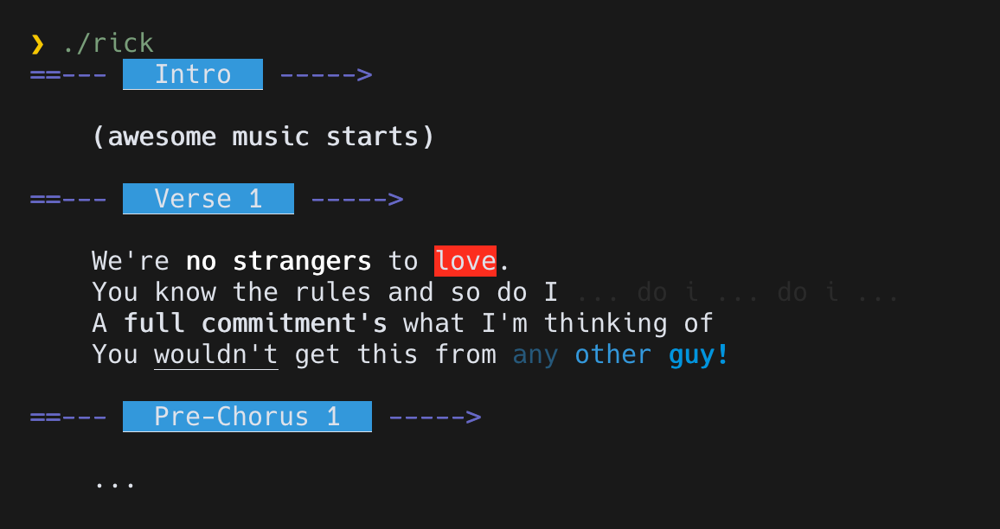

[](https://circleci.com/gh/skellock/crappyprint)

# What is `crappyprint`?


A [`nim`](https://nim-lang.org) library to build your own printing DSLs. You can target a `File`, `StringStream` or a `string`.

Use it for:

1. code generators
2. CLIs with a lot of styled text



You can find the source code for ↑ that image ↑ in `./examples/rick.nim`.

# Basic string example

```nim
import crappyprint

var print = newStringPrint()
  .text("Hello")
  .enter()
  .text("World")
  .enter()

echo $print

# seems like a crappy way to concat strings eh? ;P
```

# Basic terminal example

```nim
import terminal, crappyprint

newFilePrint()                        # spin it up & start chaining...
  .text("We're ")                     # normal text
  .text("no ", style={styleBright})   # different styles
  .text("strangers to ")
  .text("love", fg=fgWhite, bg=bgRed) # different colours
  .text(".")
  .enter()                            # next line
```

Nothing too exciting here, eh?

# Stateful Example

You can make changes to colors, styles, or indentation.

```nim
import terminal, crappyprint

newFilePrint(spacesPerIndent = 4)
  .bright()              # any text will now be bold
  .fg(fgYellow)          # and yellow
  .text("Never gonna:")
  .enter()
  .bright(false)         # text will no longer be bold
  .fg(fgDefault)         # text will be the default terminal color

  .indent()  # <-- from now on, new lines will be indented by 4 spaces

  .text("give you up").enter()
  .text("let you down").enter()
  .text("run around and desert you").enter(2)

  .unindent() # <-- restores original indentation
```

# Composition Example

The previous example is pretty messy right?

Let's clean that up by making 2 functions; `title()` and `bullet()`:

```nim
import terminal, crappyprint

proc title(print: Print, text: string): Print =
  ## Make the list title reusable.
  print
    .text(text, style={styleBright}, fg=fgYellow)
    .text(":", style={styleDim})
    .enter()
    .indent()

proc bullet(print: Print, text: string): Print =
  ## Make a bullet line reusable.
  print
    .text("* ", fg=fgGreen)
    .text(text)
    .enter()
```

With those 2 functions in play, here's what the previous example looks like now...

```nim
newFilePrint(spacesPerIndent=4)
  .title("Never gonna")
  .bullet("give you up")
  .bullet("let you down")
  .bullet("run around and desert you")
  .enter()
  .indent(0)
```

To introduce your own chainable functions, you create a function whose first parameter is `Print` and the return value is also `Print`. I recommend adding the `{.discardable.}` pragma too. For example:

```nim
proc hr*(print: Print): Print {.discardable.} =
  ## Prints a fancy line divider.
  print
    .text("-=-=-=-=-=-=-=-", style={styleBright}, fg=fgBlue)
    .enter()
```

See [this code](examples/rick.nim) for a larger example.

# Principles

-   programs should make their own styling functions (like a style guide)
-   don't reinvent colors and style from `terminal`
-   terminal printing is already stateful; so embrace that

# API

### `newStringPrint(initialValue = "", spacesPerIndent = 4)`

Returns a `Print` object used to chain styling functions. This kind of `Print` is good
for writing code generators.

| argument       | type     | description                                                      | default |
| -------------- | -------- | ---------------------------------------------------------------- | ------- |
| intialValue    | `string` | optional: the starting value to use                              | `""`    |
| spacePerIndent | `int`    | optional: how many spaces are printed for each indentation level | `4`     |

```nim
let print = newStringPrint()
```

### `newFilePrint(target = stdout, spacesPerIndent = 4)`

Returns a `Print` object used to chain styling functions. This kind of `Print` is good
for writing to the terminal.

| argument       | type   | description                                                      | default  |
| -------------- | ------ | ---------------------------------------------------------------- | -------- |
| target         | `File` | optional: where to write to                                      | `stdout` |
| spacePerIndent | `int`  | optional: how many spaces are printed for each indentation level | `4`      |

```nim
let print = newFilePrint()
```

### `newStreamPrint(target = StringStream, spacesPerIndent = 4)`

Returns a `Print` object used to chain styling functions. This kind of `Print` is good
for streaming if you're building a massive string.

| argument       | type           | description                                                      | default  |
| -------------- | -------------- | ---------------------------------------------------------------- | -------- |
| target         | `StringStream` | optional: where to write to                                      | `stdout` |
| spacePerIndent | `int`          | optional: how many spaces are printed for each indentation level | `4`      |

```nim
var ss = newStringStream()
let print = newStreamPrint(ss)
```

### `.text(value = "", fg = fgDefault, bg = bgDefault, style = {}, indentBy = 0)`

Prints text. You'll be using this one frequently.

Note that only `Print` created with `newFilePrint()` supports terminal styling colours.

| argument | type              | description                                                                  | default     |
| -------- | ----------------- | ---------------------------------------------------------------------------- | ----------- |
| value    | `string`          | the text to print                                                            | `""`        |
| fg       | `ForegroundColor` | optional: applies a foreground color to the text                             | `fgDefault` |
| bg       | `BackgroundColor` | optional: applies a background color to the text                             | `bgDefault` |
| style    | `set[Style]`      | optional: applies styling (`styleBright` for example) to the text            | `{}`        |
| indentBy | `int`             | optional: overrides the current indentation with a specific number of spaces | `0`         |

```nim
newFilePrint()
  .text("Say ")
  .text("hello ", style = {styleBold})
  .text("to my", fg = bgGreen)
  .text(" little friend!", bg = bgBlue, fg = fgWhite)
```

### `.fg(color)`

Changes the foreground color for `File`-based `Print`ers.

| argument  | type              | description                                                  |
| --------- | ----------------- | ------------------------------------------------------------ |
| **color** | `ForegroundColor` | applies a foreground color to any text written in the future |

```nim
newFilePrint()
  .text("Days since last accident: ")
  .fg(fgRed)     # <-- red text
  .text("0")
  .fg(fgDefault) # <-- normal text
  .text(".")
```

### `.bg(color)`

Changes the background color for `File`-based `Print`ers.

| argument  | type              | description                                                  |
| --------- | ----------------- | ------------------------------------------------------------ |
| **color** | `BackgroundColor` | applies a background color to any text written in the future |

```nim
newFilePrint()
  .text("Don't cry for me, Argentina.").enter(2)
  .bg(bgCyan)  # <-- cyan
  .text("           ").enter()
  .bg(bgWhite) # <-- then white
  .fg(fgYellow)
  .bright()
  .text("     *     ").enter()
  .bg(bgCyan)  # <-- then back to cyan
  .text("           ").enter()
```

### `.indent(level)`

Changes the indentation level so text will be inset from the left on each line.

| argument  | type  | description                         | default |
| --------- | ----- | ----------------------------------- | ------- |
| **level** | `int` | how many levels we should move over | `1`     |

```nim
newStringPrint()
  .text("Dear Diary,").enter(2)
  .indent() # <-- move future text to the right (4 spaces by default)
  .text("I love nim.").enter(2)
  .indent(-1) # <-- sets the indentation back
  .text("Love, ").enter(2)
  .text("Steve")
```

### `.unindent(level)`

This is the opposite of `.indent()`.

| argument  | type  | description                         | default |
| --------- | ----- | ----------------------------------- | ------- |
| **level** | `int` | how many levels we should move back | `1`     |

```nim
newStringPrint()
  .text("Dear Diary,").enter(2)
  .indent() # <-- move future text to the right
  .text("I love nim.").enter(2)
  .unindent() # <-- sets the indentation back
  .text("Love, ").enter(2)
  .text("Steve")
```

### `.space(count)`

Adds horizontal whitespace.

| argument  | type  | description                 | default |
| --------- | ----- | --------------------------- | ------- |
| **count** | `int` | the number of spaces to add | `1`     |

```nim
newStringPrint()
  .space(81) # <-- adds some spaces
  .text("the forbidden zone!")
```

### `.enter(count)`

Moves to the next line.

| argument  | type  | description                | default |
| --------- | ----- | -------------------------- | ------- |
| **count** | `int` | the number of lines to add | `1`     |

```nim
newStringPrint()
  .text("Patience...")
  .enter(4000) # <-- RIP your terminal
  .text("is a virtue.")
```

### `.bright(on)`

Makes subsequent text be bright/bold for `File`-based `Print`ers.

| argument | type   | description                      | default |
| -------- | ------ | -------------------------------- | ------- |
| **on**   | `bool` | should this style setting be on? | `true`  |

You can turn this off again with `.bright(off)`.

```nim
newFilePrint()
  .bright()      # <-- on
  .text("twinkle twinkle")
  .bright(false) # <-- off
  .text("little star")
```

### `.dim(on)`

Makes subsequent text be dim for `File`-based `Print`ers.

| argument | type   | description                      | default |
| -------- | ------ | -------------------------------- | ------- |
| **on**   | `bool` | should this style setting be on? | `true`  |

You can turn this off again with `.dim(off)`.

```nim
newFilePrint()
  .text("867-5309")
  .dim()      # <-- on
  .text("/ Jenny")
  .dim(false) # <-- off
```

# Why not use this?

-   your program doesn't print much
-   the `terminal` module is already great for styled printing
-   because I wrote this

# Changelog

#### `0.2.0` - Oct 26, 2019

-   Fixes issues with style overrides.
-   Adds support for targeting streams and strings.
-   Adds `unindent(x)` which is simply `indent(-x)`
-   Removes the quit proc for resetting the terminal because it prevented piping output as text.

#### `0.1.0` - Jan 21, 2019

-   Initial Release.

# Requirements

-   Nim 1.x

# Installing

`nimble install https://github.com/skellock/crappyprint#v0.1.0`

( NOTE: I haven't submitted this to `nimble` just yet. )

# TODOs

-   [x] make CI work
-   [x] in `text()`, make `fg`, `bg`, and `style` changes independent from each other
-   [x] finish testing all functions
-   [ ] support windows (not sure what's involved)
-   [ ] show more examples of control flow
-   [ ] change name of library?
-   [ ] submit to nimble

# License

MIT.

# Contributing

Fork it. Pull it. Patch it. Push it.

Send a PR, that should do it.
